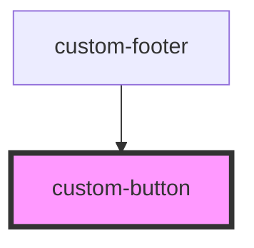

# custom-button

<!-- Auto Generated Below -->

## Properties

| Property                | Attribute                 | Description                           | Type                   | Default     |
| ----------------------- | ------------------------- | ------------------------------------- | ---------------------- | ----------- |
| `buttonType`            | `button-type`             | The type of button                    | `"primary" \| "round"` | `'primary'` |
| `disabled`              | `disabled`                | Is the button disabled                | `boolean`              | `false`     |
| `displayLoadingSpinner` | `display-loading-spinner` | Displays the loading spinner on click | `boolean`              | `false`     |

## Methods

### `setButtonState(value: 'idle' | 'loading') => Promise<void>`

Button state method, this is required for changing the state in the implementation layer

#### Returns

Type: `Promise<void>`

## Dependencies

### Used by

 - [custom-footer](../custom-footer)

### Graph

----------------------------------------------

*Built with [StencilJS](https://stenciljs.com/)*
