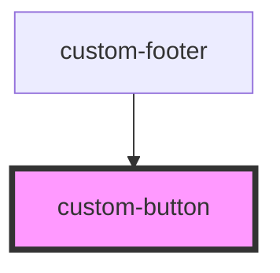

# custom-button

<!-- Auto Generated Below -->

## Properties

| Property     | Attribute     | Description            | Type                   | Default     |
| ------------ | ------------- | ---------------------- | ---------------------- | ----------- |
| `buttonType` | `button-type` | The type of button     | `"primary" \| "round"` | `'primary'` |
| `disabled`   | `disabled`    | Is the button disabled | `boolean`              | `false`     |

## Dependencies

### Used by

 - [custom-footer](../custom-footer)

### Graph

----------------------------------------------

*Built with [StencilJS](https://stenciljs.com/)*
