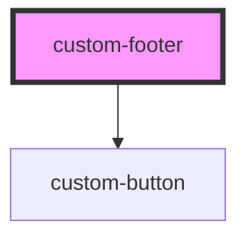

# custom-header

<!-- Auto Generated Below -->

## Properties

| Property     | Attribute     | Description                           | Type      | Default |
| ------------ | ------------- | ------------------------------------- | --------- | ------- |
| `showButton` | `show-button` | Shows or hides the back to top button | `boolean` | `true`  |

## Dependencies

### Depends on

- [custom-button](../custom-button)

### Graph

----------------------------------------------

*Built with [StencilJS](https://stenciljs.com/)*
